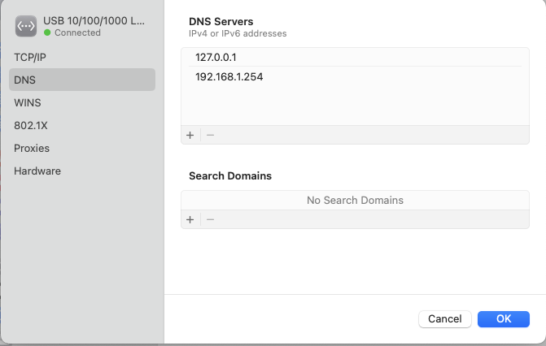

# OpenShift-CRC

Scenario:
- server: backed by Windows 10 Enterprise LTSC Build 19044 / Ryzen 5 5600U 6-core, 40GB RAM, 512GB SSD NVME, Hyper-V enabled
- client: MacOS Ventura 13 with several VPN clients to take into account (...)

**Final goal**: install On-Premise OpenShift and be able to use OpenShift from the client (**that is hosted on another computer, but in the same LAN**), either via command-line (`oc`, `kubectl`) or via browser (at https://console-openshift-console.apps-crc.testing/)

Each of the sub-sections refers to either the client or the server, so note the title, e.g. "Install CRC (**server side**)".

<!-- vscode-markdown-toc -->
* 1. [Install CRC (server side)](#InstallCRCserverside)
* 2. [Setup SSH key permissions properly (server side)](#SetupSSHkeypermissionsproperlyserverside)
* 3. [Allow incoming traffic on port 6443 (server side)](#Allowincomingtrafficonport6443serverside)
* 4. [Setup local DNS server (client side)](#SetuplocalDNSserverclientside)
	* 4.1. [/etc/hosts approach](#etchostsapproach)
	* 4.2. [dnsmasq approach](#dnsmasqapproach)
		* 4.2.1. [Disable firewall and NAT rules set by FortiClient VPN](#DisablefirewallandNATrulessetbyFortiClientVPN)
		* 4.2.2. [Add localhost to the network card's DNS server list](#AddlocalhosttothenetworkcardsDNSserverlist)
		* 4.2.3. [Install dnsmasq](#Installdnsmasq)
		* 4.2.4. [Configure dnsmasq](#Configurednsmasq)
* 5. [Improvements (client side)](#Improvementsclientside)

<!-- vscode-markdown-toc-config
	numbering=true
	autoSave=true
	/vscode-markdown-toc-config -->
<!-- /vscode-markdown-toc -->

##  1. <a name='InstallCRCserverside'></a>Install CRC (server side)
Download the appropriate installation package (OpenShift version) from https://github.com/crc-org/crc/releases

We will install CRC [CRC v2.6.0 (OpenShift 4.10.22)](https://github.com/crc-org/crc/releases/tag/v2.6.0)

After installing CRC, we have to provision the VM. Before running `crc setup`, let's configure RAM memory and monitoring. We'll avoid monitoring because, in addition to being resource-intensive, it causes problems when we go to power up the VM:

Open Windows Powershell and execute the following:
```
crc config set memory 24576
crc config set enable-cluster-monitoring false
```

Then we set up the VM
```
crc setup
```

Once created, we can decide to run `crc start` with the default parameters, among which we also find the DNS server to be used, via the `--nameserver <address>` parameter. We should take these parameters into account in case we can no longer start the VM.

##  2. <a name='SetupSSHkeypermissionsproperlyserverside'></a>Setup SSH key permissions properly (server side)
Once CRC is installed, let's give tighter permissions to the private key used to access the VM created by CRC: with Windows File Explorer, head to the CRC installation path `C:\Users\%USERNAME%\.crc`, after which we find the private key at `machines\crc\id_ecdsa`; Right-click on it, Properties, Security, Advanced, Permissions; remove from the list all the entries other than that of the currently logged in user, then click on OK, and again click on OK.

##  3. <a name='Allowincomingtrafficonport6443serverside'></a>Allow incoming traffic on port 6443 (server side)
To allow external clients to contact the OpenShift API on port 6443, incoming traffic must be allowed, which by default is blocked for hosts other than localhost. Of the many methods, for now we choose the least painless (and also the most insecure).

**NOTE: this step must be repeated each time we restart the VM CRC**

- Access the VM via SSH:
Open Windows Powershell and execute the following:
```
ssh -i ~/.crc/machines/crc/id_edcsa -o StrictHostKeyChecking=no -o UserKnownHostsFile=/dev/null core@127.0.0.1 -p 2222
```
- Once inside, execute these commands
```
curl -X POST -d '{"local":"127.0.0.1:6443"}'  gateway.containers.internal/services/forwarder/unexpose
curl -X POST -d '{"local":":6443","remote":"192.168.127.2:6443"}'  gateway.containers.internal/services/forwarder/expose
```
- Exit the VM
```
exit
```

##  4. <a name='SetuplocalDNSserverclientside'></a>Setup local DNS server (client side)
Assume that client and server are connected to the same LAN and that the server has a static IP address set to `192.168.1.139`.

The steps below could be avoided by acting directly on the `/etc/hosts` file, but since we are masochists, we will use **dnsmasq**. We'll show both approaches anyway below `:)`.

###  4.1. <a name='etchostsapproach'></a>/etc/hosts approach

The fastest method, which also requires root permissions, is as follows:

Edit the file /etc/hosts with a text editor, e.g. `vi /etc/hosts`, by adding the following lines (recall that we previously assumed `192.168.1.139` was the IP of the CRC server)

```
192.168.1.139 console-openshift-console.apps-crc.testing
192.168.1.139 oauth-openshift.apps-crc.testing
192.168.1.139 api.crc.testing
```

###  4.2. <a name='dnsmasqapproach'></a>dnsmasq approach

####  4.2.1. <a name='DisablefirewallandNATrulessetbyFortiClientVPN'></a>Disable firewall and NAT rules set by FortiClient VPN
In our case, the client has many VPN clients installed. These include FortiClient VPN, which compromises the normal functioning of DNS. We will therefore follow some workarounds found online (source: [StackOverflow](https://stackoverflow.com/a/73956467/15478600));

FortiClient VPN enables the `pf` firewall + NAT DNS Redirect; We can confirm that by executing the following:

```
sudo pfctl -s nat
```

Output:

```
rdr pass inet proto udp from any to any port = 53 -> 127.0.0.1 port 53535
```

Workoaround (reset pf, **NOTE: probably has to be executed every time we restart the client**):

```
# reset the rules based off the on-disk version
sudo pfctl -N -f /etc/pf.conf

# clear the DNS cache on system
sudo dscacheutil -flushcache
sudo killall -HUP mDNSResponder
```

####  4.2.2. <a name='AddlocalhosttothenetworkcardsDNSserverlist'></a>Add localhost to the network card's DNS server list

In my case, I am using "USB 10/100/1000 LAN" as Network; Head to System Settings, Network, select the Network, Details, DNS, Add `127.0.0.1` as first entry, Add the other DNS servers after that (In my case, `192.168.1.254` is the Router's IP), OK.



We'll notice that the `/etc/resolv.conf` file will now have the following content, if not, try disconnecting and reconnecting to the network:

```
...
nameserver 127.0.0.1
nameserver 192.168.1.254
```

####  4.2.3. <a name='Installdnsmasq'></a>Install dnsmasq

We'll use `brew`:

```
brew update
brew install dnsmasq
```

####  4.2.4. <a name='Configurednsmasq'></a>Configure dnsmasq
For the following steps, I have put together blog articles and pieces of code found in the following links:

- https://www.stevenrombauts.be/2018/01/use-dnsmasq-instead-of-etc-hosts/
- https://github.com/ksingh7/openspot/blob/main/aws/mac_client.sh

In my case, I left the main configuration file `/usr/local/etc/dnsmasq.conf` untouched, while I added some files:

```
mkdir -p /usr/local/etc/dnsmasq.d
touch /usr/local/etc/dnsmasq.d/development.conf
export OC_SERVER_ADDRESS=192.168.1.139
echo "address=/apps-crc.testing/$OC_SERVER_ADDRESS" > /usr/local/etc/dnsmasq.d/crc.conf ;
echo "address=/api.crc.testing/$OC_SERVER_ADDRESS" >> /usr/local/etc/dnsmasq.d/crc.conf ;
sudo brew services restart dnsmasq
```

Let's check that dnsmasq is working:

```
sudo brew services list
```

Expected output (Status = `started`):

```
Name         Status  User File
dnsmasq      started root /Library/LaunchDaemons/homebrew.mxcl.dnsmasq.plist
...
```

Test with dig:

```
dig console-openshift-console.apps-crc.testing 127.0.0.1
```

Expected output:
```
...
;; ANSWER SECTION:
console-openshift-console.apps-crc.testing. 0 IN A 192.168.1.139
...
```

Test with ping:

```
ping -c 1 console-openshift-console.apps-crc.testing
```

Expected output:

```
PING console-openshift-console.apps-crc.testing (192.168.1.139): 56 data bytes
64 bytes from 192.168.1.139: icmp_seq=0 ttl=128 time=5.537 ms

--- console-openshift-console.apps-crc.testing ping statistics ---
1 packets transmitted, 1 packets received, 0.0% packet loss
round-trip min/avg/max/stddev = 5.537/5.537/5.537/0.000 ms
```

The initial goal was achieved.

##  5. <a name='Improvementsclientside'></a>Improvements (client side)

If we wanted to avoid a root-user approach and, in addition, wanted to try to solve the problems of FortiClient VPN in a more automatic manner, we could take inspiration from the following article: https://www.stevenrombauts.be/2019/06/restart-dnsmasq-without-sudo/

Other useful links:
- [CRC tool](https://github.com/crc-org/crc)
- Cloud
  - [CRC cloud tool](https://github.com/crc-org/crc-cloud)
  - [Openspot](https://github.com/ksingh7/openspot)